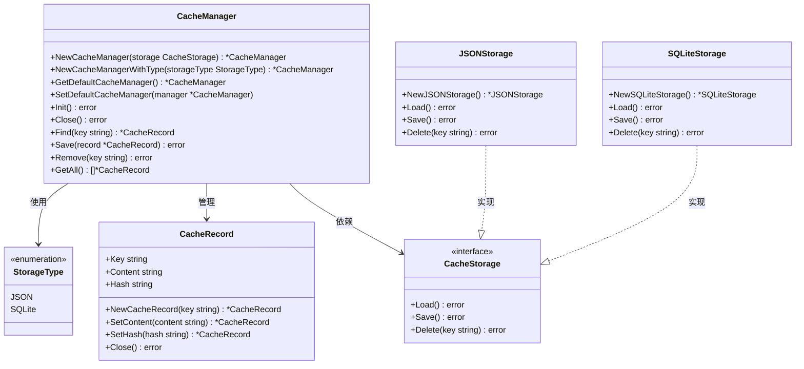
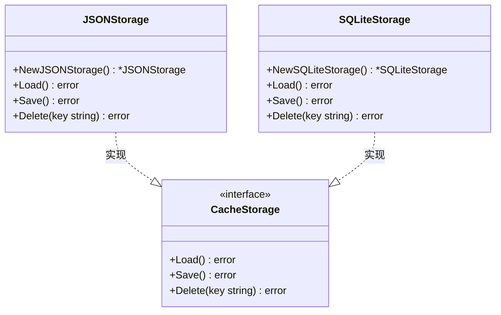
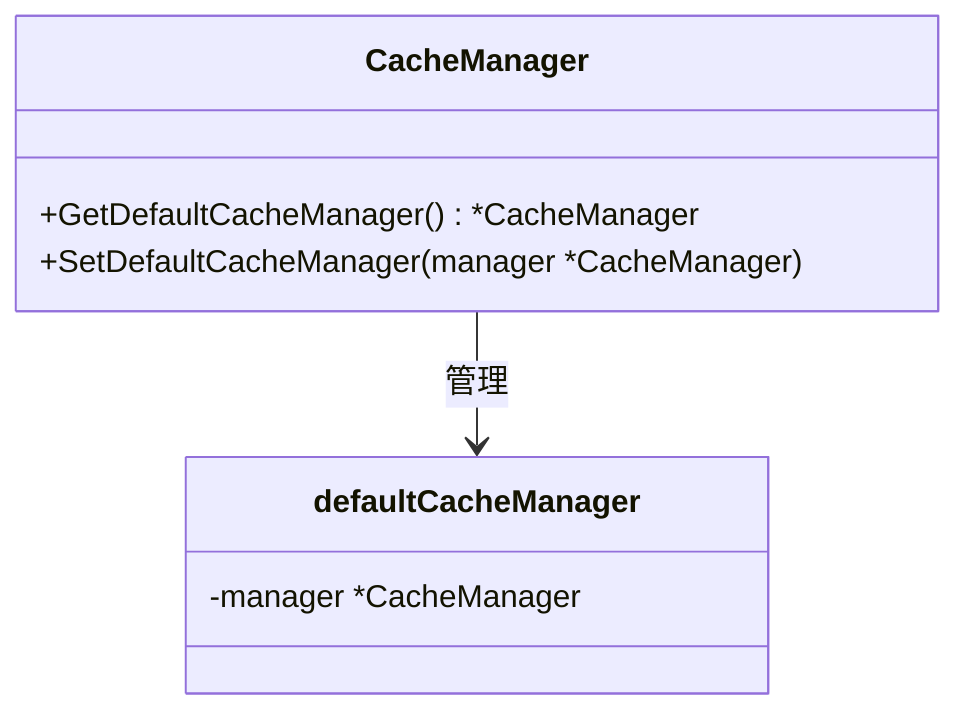
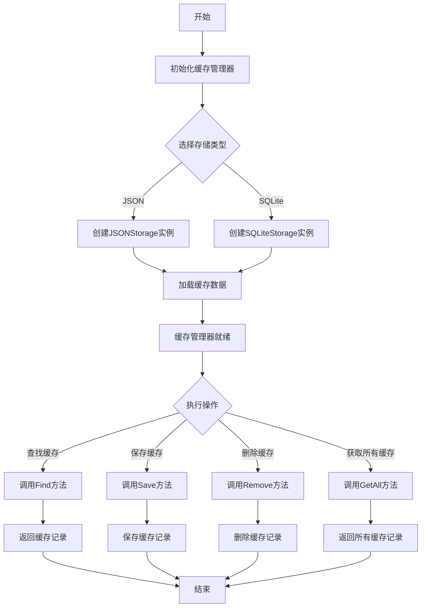
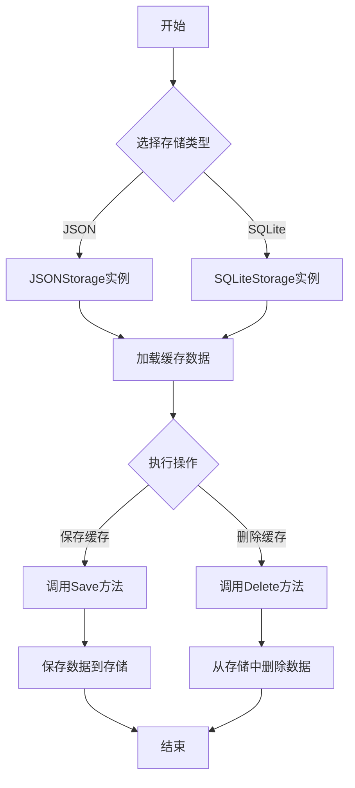

### **1. 缓存管理模块的类图**

---

### **2. 存储模块的类图**

---

### **3. 默认缓存管理模块的类图**

---

### **4. 缓存管理模块的流程图**
以下是缓存管理模块的核心操作流程，包括初始化、查找、保存和删除缓存记录。

---

### **5. 存储模块的流程图**
以下是存储模块的核心操作流程，包括加载、保存和删除缓存数据。

---